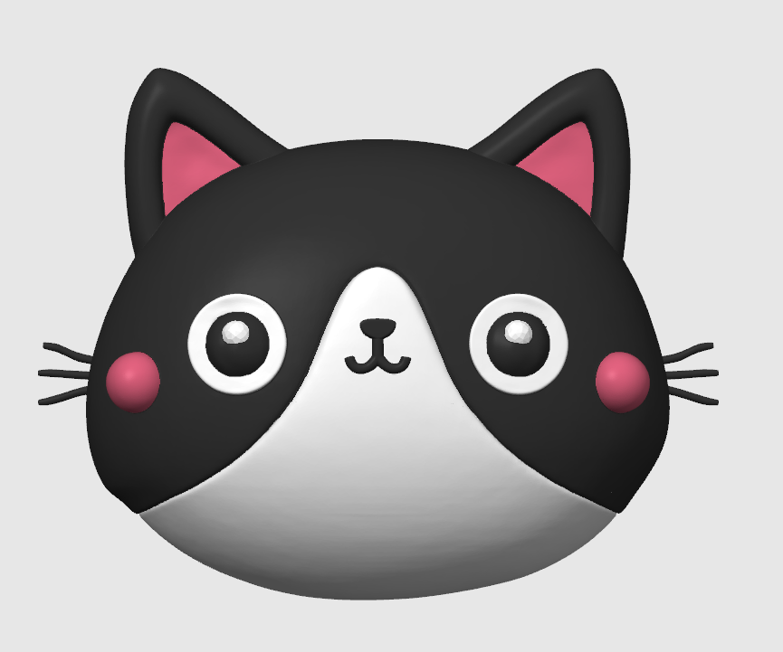
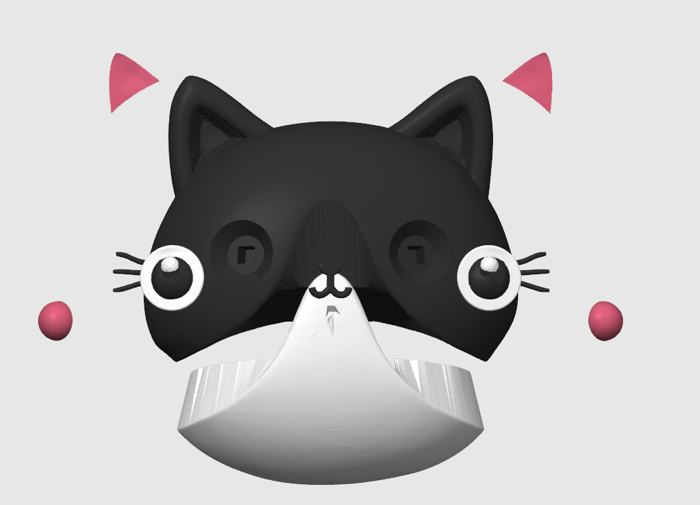

# Automated 3D Model Splitting

[简体中文（Default）](README.md) | [English](README.en.md) | [日本語](README.ja.md) | [한국어](README.ko.md)

**Turn a painted, one-piece model into parts you can print in separate colors and assemble.**

You find a cat model you love and want to print its eyes, nose, and ears separately. Then you open the file: the colors are separate, but the parts aren't. Splitting them yourself means learning to model, cut, and make matching sockets.

This tool helps you get past that step. Give your AI assistant a supported painted 3MF, and it separates suitable color regions into parts with matching assembly features. You receive a 3MF that keeps the original color assignments and assembly layout, ready for you to review in a slicer and prepare for printing.

It's for 3D printing hobbyists who want to make multicolor pieces without first learning part modeling. Printing a little cat shouldn't require enrolling in a modeling course.

## When it helps

| What gets in your way | How it helps |
| --- | --- |
| The model is painted, but you can't select its eyes, mouth, or decorations for separate printing | Turns suitable color regions into independent parts so you can plan their colors and prints separately |
| You want to print parts separately and assemble them, but don't know how to make mounting features | Adds matching inserts and sockets, with room for assembly |
| You're worried about losing colors or figuring out where each part belongs | Keeps the original color assignments, AMS filament slots, and assembly positions together in one model |
| You can't tell from a description whether a small marking is worth printing separately | Shows whole-model and close-up images of regions that need a decision, so you can choose which to keep as parts |

## See an example

The same cat head before and after splitting: a painted, one-piece model becomes an assembly where the ears, forehead marking, eyes, nose, and cheeks can be separate parts.

| Before: painted, but still one piece | After: print parts separately, then assemble |
| :---: | :---: |
|  |  |

Left: before splitting. Right: an exploded view of the split parts.

[Download the cathead.3mf example](example/cathead.3mf)

## Will my model work?

The current focus is **Bambu painted-project 3MF files** containing paint information the tool can read. A `.3mf` extension or a colorful appearance alone doesn't guarantee compatibility. Ask your assistant to check the file first.

Automatic splitting of single-color models is not supported yet. Very thin features, damaged models, or complicated part relationships may need repair or your input on how to split them.

## Get started

This is a Skill for an AI assistant. Use an assistant environment that supports installing Skills, accessing model files, and running Python.

### 1. Ask your assistant to install it

Copy and send this prompt:

```text
Install the automated-3d-model-splitting 2.1.0 Skill and its required dependencies from https://github.com/BensonZeng00/automated-3d-model-splitting. Once installed, ask whether I'd like to try the bundled cathead.3mf example.
```

Start with the example to get familiar with the process, or provide your own model.

### 2. Provide a model and say what matters to you

Upload a painted 3MF or give your assistant its file location, then say:

```text
Use $automated-3d-model-splitting to turn this model into parts I can print in separate colors and assemble. Keep the original color assignments, give me the assembly 3MF, and explain the validation results.
```

Add any details you care about, such as: "Keep the eyes, mouth, and tongue visible; other parts must not cover them." If small regions need your judgment, the assistant shows images and continues with your choices.

### 3. Open the result and prepare your print

After successful processing and validation, you receive an **assembly `.3mf` file**. You can select individual parts while keeping their original color assignments and assembly positions. Open it in your slicer to inspect the details and plan how to print each part.

The assistant also explains how many parts were created, whether colors were preserved, whether checks passed, and anything that needs attention. If processing is incomplete, it tells you where it stopped and what has been completed.

## Before you print

**Check the fit with a test print.** By default, the current version scales complete non-body parts to 99% of their original size to leave assembly clearance; the body stays at its original size. This also changes exterior dimensions and seam gaps. The final fit depends on your model, material, and print settings.

**File checks don't replace a physical test fit.** The assistant checks the model, colors, and assembly, and explains any checks accepted under tolerance rules. Before printing, review the whole model, part list, and details such as eyes and mouths in your slicer. Share screenshots with your assistant if you'd like help reviewing them.

For complex models, you can ask the assistant to keep progress and problem records so work can continue later.

---

Current version: `2.1.0` · [Test results and verified scope](TEST_RESULTS.md) · [Contributing](CONTRIBUTING.md) · [Apache License 2.0](LICENSE)
